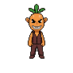

# Kitchen Chaos Tycoon — 아트 표준

> 최종 업데이트: 2026-04-11

## 핵심 원칙

**Phase 20부터 생성되는 모든 신규 에셋은 이 표준을 따른다.**
기존 Phase 1~19 에셋 리워크는 별도 Phase 28에서 진행한다.

---

## 앵커 이미지 (아트 방향 기준)

> 모든 에셋의 스타일 기준이 되는 레퍼런스 이미지.
> 새 에셋 생성 시 이 이미지와 스타일이 일치하는지 확인한다.

| 항목 | 값 |
|------|-----|
| **캐릭터** | 당근 고블린 (Carrot Goblin) |
| **파일** | `assets/enemies/carrot_goblin/carrot_goblin_64px_anchor.png` |
| **PixelLab Character ID** | `ca774523-aeca-4f33-8495-4fb0db4ba22a` |



---

## PixelLab 표준 설정

### 캐릭터 (적/보스/셰프)

```json
{
  "size": 64,
  "n_directions": 8,
  "view": "low top-down",
  "outline": "single color black outline",
  "shading": "basic shading",
  "detail": "medium detail",
  "proportions": { "type": "preset", "name": "chibi" }
}
```

### 애니메이션

- 이동 애니메이션: `template_animation_id: "walking-8-frames"`
- 공격 애니메이션: 캐릭터 특성에 맞게 선택

### 해상도 근거

| 항목 | 수치 |
|------|------|
| 게임 캔버스 | 360×640px |
| 일반 적 렌더 크기 | 35px |
| 보스 렌더 크기 | 50px |
| **원본 권장 크기** | **64px** (다운스케일 0.55× → 선명도 충분) |

96px 이상은 오버스펙 (메모리/로딩 증가 대비 품질 차이 미미).

---

## 에셋 등록 절차

새 캐릭터 에셋 생성 시:

1. 위 표준 설정으로 PixelLab 생성
2. `assets/{카테고리}/{캐릭터명}/` 폴더에 저장
3. `metadata.json`에 Character ID, 프롬프트, 설정 기록
4. 이 문서 하단 **에셋 레지스트리**에 항목 추가

---

## 에셋 레지스트리

### 적 (Enemies)

| 캐릭터 | 원본 크기 | 리워크 크기 | Character ID | 상태 |
|--------|----------|------------|--------------|------|
| 당근 고블린 | 48px | 64px | `ca774523-aeca-4f33-8495-4fb0db4ba22a` | ✅ 앵커 |
| (나머지 15종) | 32px | - | - | 📋 Phase 28 |
| 그림자 용 새끼 (shadow_dragon_spawn) | 64px | - | (AD 모드1 이후 기입) | 📋 Phase 25-1 |
| 웍 수호자 (wok_guardian) | 64px | - | (AD 모드1 이후 기입) | 📋 Phase 25-1 |

### 보스 (Bosses)

| 캐릭터 | 원본 크기 | 리워크 크기 | Character ID | 상태 |
|--------|----------|------------|--------------|------|
| (4종) | 48px | - | - | 📋 Phase 28 |

### 셰프 (Chefs)

| 캐릭터 | 원본 크기 | 리워크 크기 | Character ID | 상태 |
|--------|----------|------------|--------------|------|
| (5종) | 48px | - | - | 📋 Phase 28 |

---

## 손님 NPC (Customers — Service Scene)

> 최초 기준: 2026-04-11 (일반 손님 애니메이션 세트 v1)

### PixelLab 설정

```json
{
  "size": 32,
  "n_directions": 4,
  "view": "low top-down",
  "outline": "single color black outline",
  "shading": "basic shading",
  "detail": "medium detail"
}
```

**비교**: 적/보스는 64px + chibi. 손님은 32px + default — 테이블 배치 시 비율 균형.

### 애니메이션 세트 (6종)

| 상태 | 이름 | 생성 방법 | 방향 | 용도 |
|------|------|----------|------|------|
| 이동 | `walk` | template: `walking-4-frames` | 4방향 | 입장 → 테이블 이동 |
| 착석 | `sit` | custom: "sitting upright in chair at table, arms resting" | south 우선 | 의자 착석 전환 (20gen/방향) |
| 식사 | `eat` | template: `drinking` | 4방향 | 음식 먹는 중 (상체만 표시) |
| 만족 | `reaction_happy` | template: `jumping-1` | 4방향 | 음식 맛있을 때 |
| 덤덤 | `reaction_neutral` | template: `breathing-idle` | 4방향 | 기대 이하 음식 |
| 화남 | `reaction_angry` | template: `taking-punch` | 4방향 | 불만족, 오래 기다림 |

### 앉은 상태 렌더링 — 깊이 분할 (Depth Split)

My Cafe 방식. 테이블 스프라이트를 `splitY` 기준으로 앞/뒤로 나눠 캐릭터를 사이에 삽입.

**렌더 순서:**
```
1. 테이블 뒷부분 (Y < splitY, clip)
2. 캐릭터 스프라이트 (전체 — 앉은 포즈)
3. 테이블 앞면 (Y > splitY, clip) → 하체 가림
```

**구현 파라미터:**

| 파라미터 | 기본값 | 설명 |
|---------|--------|------|
| `splitPct` | 42% | 테이블 sprite height 기준 분할선 Y (테이블 앞면 상단) |
| `custScale` | 2.5× | 32px → 80×108px 표시 |
| `chestFrac` | 0.45 from top | 가슴이 splitY에 오도록 배치 기준 |
| `custFeetY` | `splitY + CH × 0.55 + offset` | 발 위치 계산식 |

**결과:** 머리+상체가 테이블 위로 노출, 하체는 테이블 앞면에 가려짐.

**조정 범위:**
- `splitPct` 35~55% — 테이블 종류마다 앞면 높이 다름
- `offset` ±20px — 손님 체형/크기에 따라 미세 조정

### 에셋 레지스트리 — 손님

| 캐릭터 | 타입 | Character ID | 파일 | 상태 |
|--------|------|--------------|------|------|
| 일반 손님 | `normal` | `03ccc077-88c0-4664-81ac-7992f0705bb7` | `assets/service/customer_normal.png` | ✅ 기준 (애니세트 완성) |
| VIP 손님 | `vip` | - | `assets/service/customer_vip.png` | 📋 리워크 예정 |
| 미식가 | `gourmet` | - | `assets/service/customer_gourmet.png` | 📋 리워크 예정 |
| 급한 손님 | `rushed` | - | `assets/service/customer_rushed.png` | 📋 리워크 예정 |
