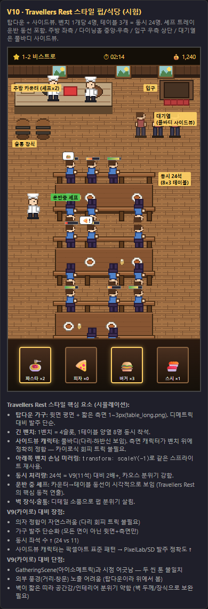
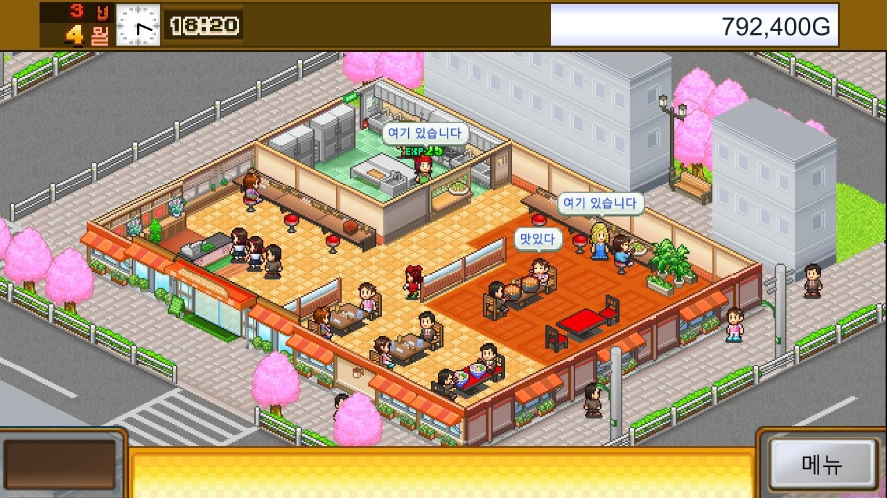
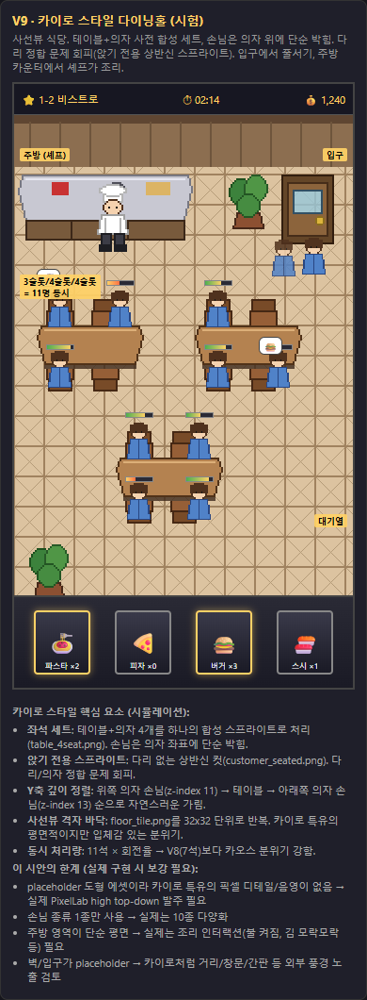

# Kitchen Chaos — 영업씬 태번(Travellers Rest) 스타일 방향성

> 작성일: 2026-04-23
> 상태: **방향성 확정** (시험 시안 V10 채택, 본 구현 미착수)
> 관련 문서:
> - [SERVICE_SCENE_KAIRO_DIRECTION.md](SERVICE_SCENE_KAIRO_DIRECTION.md) — 직전 후보(카이로 디메트릭), V10 비교 후 폐기
> - [SERVICE_SCENE_REDESIGN.md](SERVICE_SCENE_REDESIGN.md) — Phase 50~52 시점 방향성, 일부 미술 가이드만 계승

---

## 0. 본 문서의 위치

영업씬 재설계 방향성은 다음 순서로 변경되었다:

```
[Phase 50~52] 아이소메트릭 격자 + 3레이어 분리 렌더링
     ↓ Phase 76 손님 NPC 확장에서 의자 정합·규격 호환 한계 노출
[Phase 76 직후] 카이로 소프트 디메트릭 사선뷰 (V9 시안)
     ↓ Travellers Rest 스타일 검토 후, 어셋 발주 난이도·정합 자연스러움·동시 좌석 수에서 우위 확인
[현재] 태번(Travellers Rest) 스타일 — 탑다운 가구 + 사이드뷰 풀바디 캐릭터  ← 본 문서
```

본 문서는 V10 시험 시안(2026-04-23) 검증 결과 **본 구현 진입 직전 단계**의 지향점·핵심 원칙·기준 시안을 정리한다. 구체적 페이즈 분할, 마이그레이션 계획, 코드 변경 명세는 별도 스펙 문서에서 다룬다.

---

## 1. 지향점 한 줄 요약

> **Travellers Rest 식 탑다운 펍/식당 — 긴 벤치에 사이드뷰 풀바디 손님이 측면으로 앉아 다리·하반신이 자연스럽게 정합되며, 셰프가 카운터에서 테이블로 트레이를 운반하는 동선이 시각적으로 보이는 구조.**

---

## 2. 레퍼런스

### 2-1. 1차 레퍼런스: Travellers Rest (Isolated Games, 2020~)

탑다운 + 사이드뷰 캐릭터 패턴의 펍 운영 시뮬. Stardew Valley 계열 픽셀아트 표준 위에 펍/주점 컨텐츠를 얹은 구조.

**이 레퍼런스에서 채용할 요소**:

| 요소 | 채용 여부 | 비고 |
|------|----------|------|
| 탑다운(거의 정수직) 카메라 | ✅ 채용 | 약 80°, 가구 윗면 강조 |
| 가구 윗면 평면 + 짧은 측면(1~3px) | ✅ 채용 | 모든 면 입체 표현 폐기 |
| 캐릭터 사이드뷰 풀바디 | ✅ 채용 | 다리·하반신 보임 |
| 긴 벤치 (1줄 4~6명 동시 착석) | ✅ 채용 | 좌석 단위로 4인 테이블 폐기 |
| 위/아래 벤치 손님 별도 스프라이트 | ✅ 채용 | scaleY 미러링 금지, facing-up·facing-down 분리 |
| 셰프가 카운터→테이블 트레이 운반 | ✅ 채용 | "운반 중" 변형 스프라이트 필수 |
| 벽 가로 두께 + 벽 장식(액자·창문) | ✅ 채용 | 공간감 보완 |
| 술통·바·통 등 펍 소품 | ✅ 채용 | 챕터별 인테리어 변주 |
| 외부 풍경 노출 | ✗ 미채용 | 탑다운 시점상 불가능 |
| 다층 건물 | ✗ 미채용 | 모바일 화면 한계 |

### 2-2. 시험 시안 V10



`studio-mockup/kitchen-chaos/travellers-style-mockup.html` 에서 인터랙티브 확인 가능.
PIL 도형 placeholder로 레이아웃 구조만 검증한 시안. **실제 에셋이 아니다.**

### 2-3. 비교 검토된 직전 후보: 카이로 소프트 디메트릭 (V9, 폐기)




V9과의 비교 결과 V10이 다음 항목에서 우위:

| 항목 | V9 카이로 | **V10 태번** |
|------|----------|-------------|
| 의자 정합 자연스러움 | △ (상반신 컷 회피) | ◎ (벤치+사이드 풀바디 자연 정합) |
| 가구 발주 난이도 | 중 (모든 면 표현) | **하** (윗면+짧은 측면) |
| 동시 좌석 수 | 11석 (4인 테이블 ×2~3) | **24석 (8인 테이블 ×3)** |
| 픽셀아트 표준성 | 중 (일본 게임 특화) | **상** (Stardew/Terraria 계열) |
| PixelLab/SD 발주 정확도 | 중 | **상** (학습 데이터 풍부) |
| GatheringScene과 시점 통일성 | ◎ | △ (탑다운으로 분리) |
| 외부 풍경 노출 | ◎ | ✗ |
| 카오스 분위기 강도 | 중 | **강** |

핵심 트레이드오프는 **"GatheringScene과 시점 통일성을 포기하는 대신 어셋 난이도·정합·밀도를 얻는다"**. 게임 정체성상 영업씬은 채집씬과 명확히 다른 모드이므로, 시각 분리도 허용한다는 판단.

---

## 3. 핵심 원칙

### 3-1. 가구는 탑다운, 캐릭터는 사이드뷰

이 게임의 영업씬 시각 정체성은 **가구의 시점과 캐릭터의 시점이 다르다**는 한 줄로 요약된다. Stardew Valley·Terraria·Travellers Rest가 공유하는 패턴.

- **가구**: 윗면이 평면으로 보이고, 측면은 1~3px 두께로 짧게 표현된 거의 정수직 탑다운
- **캐릭터**: 좌·우 측면을 향한 풀바디(머리부터 발끝까지)
- 이 조합이 픽셀아트에서 **인체 비율을 가장 정확하게 표현**하며, **벤치 위 측면 좌석 자세**도 자연스럽게 정합된다.

### 3-2. 좌석은 "긴 벤치 + 슬롯" 단위

```
─── 위쪽 벤치 (facing-down 손님 4명) ───
│ 손님1    손님2    손님3    손님4 │
═══════════════════════════════════════
[ 긴 테이블 (음식 접시·잔 장식) ]
═══════════════════════════════════════
│ 손님A    손님B    손님C    손님D │
─── 아래쪽 벤치 (facing-up 손님 4명) ───
```

- 긴 벤치 1개 = 4~5 슬롯, 한 테이블 양옆 = 8~10명 동시 착석
- 벤치는 사전 합성 스프라이트(테이블+양 벤치는 분리, 벤치는 단독 1장)
- 손님은 벤치 위 슬롯 좌표에 단순 박힘
- 위쪽 벤치 손님과 아래쪽 벤치 손님은 **서로 다른 스프라이트** (facing-up / facing-down)
  - ⚠️ V10 시안에서 사용한 `transform: scaleY(-1)` 미러링은 머리가 거꾸로 보여 부적합. 본 발주 시 facing-up 별도 스프라이트 필수

### 3-3. 손님 스프라이트 시트

| 상태 | 파일 패턴 | 해상도 | 용도 |
|------|----------|--------|------|
| 걷기 (좌·우) | `customer_{type}_walk_{l/r}.png` (4프레임 시트) | 16×24 | 입장·퇴장·테이블 이동·줄서기 |
| 앉기 (위쪽 벤치, 머리 위) | `customer_{type}_seated_down.png` | 16×22 | 위쪽 벤치 = 머리 위, 몸이 테이블 향함 |
| 앉기 (아래쪽 벤치, 머리 아래) | `customer_{type}_seated_up.png` | 16×22 | 아래쪽 벤치 = 머리 아래, 몸이 테이블 향함 (별도 그림) |
| 식사 (선택) | `customer_{type}_eating_{down/up}.png` 또는 2프레임 | 16×22 | 음식 받은 후 |
| 만족 (선택) | `customer_{type}_happy_{down/up}.png` | 16×22 | 결제 직전 |

**기존 자산 재활용**: Phase 76 신규 92×92 풀바디 손님 10종은 **그대로 사용 불가**(시점·해상도 모두 미스매치). 단, 캐릭터 디자인(헤어·복장·피부)은 그대로 계승하여 사이드뷰로 재발주.

### 3-4. 셰프 스프라이트 시트 (운반 동선 핵심)

| 상태 | 파일 패턴 | 비고 |
|------|----------|------|
| 카운터 idle | `chef_{name}_idle_side.png` | 카운터 안쪽에 서 있음 |
| 조리 중 | `chef_{name}_cooking.png` (2프레임) | 도마/팬 모션 |
| 트레이 운반 (좌·우) | `chef_{name}_carry_{l/r}.png` (4프레임 시트) | **트레이가 양손에 보이도록**, 카운터→테이블 이동 |
| 서빙 모션 | `chef_{name}_serve.png` | 트레이 내려놓는 1프레임 |

**셰프 동선**: 카운터에서 조리 완료 → 트레이 들고 해당 테이블로 이동 → 서빙 → 카운터 복귀. 이 동선이 시각적으로 보이는 것이 Travellers Rest 분위기의 핵심.

### 3-5. Y축 단순 깊이 정렬

```
위쪽 벤치 (z: y-좌표)
     ↓ 아래일수록 큰 z, 자연스럽게 가림
긴 테이블
     ↓
아래쪽 벤치
     ↓
이동 중 손님·셰프 (z: 자기 y-좌표)
```

탑다운이라 디메트릭 z-offset 계산이 불필요. **모든 오브젝트의 z는 자기 발 위치 y좌표** 단순 공식. 의자·테이블·벤치는 미리 정해진 슬롯 깊이 사용.

### 3-6. 공간 분할 (360×640 잠정안)

```
┌─────────────────────────────────────────┐
│ HUD (타이머 / 골드 / 챕터)         │ 32px
├─────────────────────────────────────────┤
│  ━━━━━ 가로 두꺼운 벽 (액자/창문) ━━━━━│ 24px
├──────────────┬──────────────────────────┤
│              │                          │
│  주방 카운터 │   다이닝홀 (목재 마룻)   │
│  + 셰프(idle)│                          │
│              │   ━━━━━━━ 벤치 ━━━━━━━ │ 좌석세트 1
│  술통×2     │   ▥▥▥▥▥ 테이블 ▥▥▥▥▥ │
│  (장식)      │   ━━━━━━━ 벤치 ━━━━━━━ │
│              │                          │
│              │   ━━━━━━━ 벤치 ━━━━━━━ │ 좌석세트 2
│              │   ▥▥▥▥▥ 테이블 ▥▥▥▥▥ │
│              │   ━━━━━━━ 벤치 ━━━━━━━ │
│              │                          │
│              │   ━━━━━━━ 벤치 ━━━━━━━ │ 좌석세트 3
│              │   ▥▥▥▥▥ 테이블 ▥▥▥▥▥ │
│              │   ━━━━━━━ 벤치 ━━━━━━━ │
│              │                          │
│  ┌────┐     │                ┌────┐  │
│  │입구│     │  ←── 대기열 ──→│대기│  │
│  │카펫│     │                │손님│  │
│  └────┘     │                └────┘  │ 528px
├──────────────┴──────────────────────────┤
│ 컨트롤 바 (요리 카드 / 일시정지 등)   │ 80px
└─────────────────────────────────────────┘
                  360px
```

- **좌측 1/3 = 주방·카운터·창고 영역** (셰프 idle, 술통, 카운터 상판)
- **우측 2/3 = 다이닝홀** (긴 테이블 3개 세트, 동시 24석)
- **입구는 좌측 또는 우측 하단** (V10에서는 우측 상단이지만 대기열 동선상 좌측 하단도 검토)
- **대기열은 풀바디 사이드뷰 손님** (앉기 스프라이트 X, walking 스프라이트 사용)

### 3-7. 챕터별 테마 변주

기존 [SERVICE_SCENE_REDESIGN.md §2-2](SERVICE_SCENE_REDESIGN.md) 매핑을 계승하되, **바닥+벽+벤치+테이블+벽 장식+술통/소품**까지 6개 변주 그룹을 묶어 발주한다.

| 그룹 | 챕터 | 바닥 | 벽 | 가구·장식 |
|------|------|------|-----|----------|
| g1 | 1~6장 | 따뜻한 목재 마룻 | 황토 회벽 | 원목 벤치, 도마, 술통 |
| g2-jp | 7~9장 | 다다미 + 짙은 원목 | 한지 미닫이 | 좌식 방석, 사케병 |
| g2-cn | 10~12장 | 붉은 주단 + 목재 | 금색 패널 | 원형 의자, 차호 |
| g2-fr | 13~15장 | 흑백 체크 타일 | 와인색 페인트 | 의자, 와인병 |
| g3-in | 16~18장 | 모자이크 타일 | 코발트 패널 | 라탄 의자, 향로 |
| g3-mx | 19~21장 | 테라코타 + 흰 | 노랑 회벽 | 나무 의자, 선인장 |
| g3-de | 22~24장 | 파스텔 대리석 | 흰 패널 | 흰 의자, 케이크 진열대 |
| endless | ∞ | 보라 에너지 격자 | 검은 마법진 | 보라 좌석, 미력 결정 |

---

## 4. 폐기·보류·계승 정리

| 항목 | 처리 | 사유 |
|------|------|------|
| Phase 50~52 아이소메트릭 격자 | 폐기 확정 | 탑다운으로 시점 변경 |
| Phase 50~52 테이블 `_back`/`_front` 분리 | 폐기 확정 | 탑다운에서는 단일 스프라이트로 충분 |
| Phase 50~52 `_occupied` 컴포짓 | 폐기 확정 | 벤치+손님 분리로 대체 |
| 카이로식 디메트릭 사선뷰 (V9) | 폐기 확정 | V10 비교 검토 결과 |
| 카이로식 상반신 컷 손님 | 폐기 확정 | 사이드뷰 풀바디로 대체 |
| 카이로식 4인 테이블 사전 합성 | 폐기 확정 | 긴 벤치 + 손님 분리 단순 정합 |
| Phase 76 신규 92×92 풀바디 손님 | 보류 (재발주 필요) | 시점·해상도 미스매치, 디자인만 계승 |
| Phase 50~52 챕터별 배경 차별화 매핑 | **계승** | 그룹1~3 + 엔드리스 8세트 |
| Phase 50~52 미술 가이드 (웜 다크 팔레트, 과한 사실주의 금지) | **계승** | 동일 적용 |
| GatheringScene 시점 통일성 | **포기** (의도적) | 영업씬은 별 모드로 시각 분리 허용 |

---

## 5. 신규 에셋 생성 계획 (개략)

본 절은 개략이며, 구체 발주 명세는 별도 스펙에서 작성한다.

### 5-1. 좌석 세트 (벤치 + 테이블 분리)

| 등급 | 벤치 | 테이블 |
|------|------|--------|
| lv0 | `bench_lv0_long.png` (96×14) | `table_lv0_long.png` (96×40) |
| lv1 | `bench_lv1_long.png` | `table_lv1_long.png` |
| lv2 | `bench_lv2_long.png` | `table_lv2_long.png` |
| lv3 | `bench_lv3_long.png` (128×14, 5인) | `table_lv3_long.png` (128×40) |
| lv4 | `bench_lv4_long.png` (160×14, 6인) | `table_lv4_long.png` (160×40) |

**좌석 슬롯 데이터** (벤치 텍스처에 종속, 코드에서 상수 정의):

```javascript
const BENCH_SLOTS = {
  bench_lv0_long: [{ x: 16 }, { x: 40 }, { x: 64 }, { x: 88 }],   // 4인
  bench_lv3_long: [{ x: 16 }, { x: 40 }, { x: 64 }, { x: 88 }, { x: 112 }],  // 5인
  bench_lv4_long: [...],  // 6인
};
```

### 5-2. 손님 사이드뷰 스프라이트 (10종 × 2방향 × 상태)

Phase 76 10종 손님(normal, vip, gourmet, rushed, group, critic, regular, student, traveler, business)을 사이드뷰로 재발주:

| 종류 | 파일 패턴 | 해상도 | 매수 |
|------|----------|--------|------|
| 걷기 좌·우 | `customer_{type}_walk_{l/r}.png` (4프레임 시트) | 16×24 | 10종 × 2방향 = 20장 |
| 앉기 facing-down (위쪽 벤치) | `customer_{type}_seated_down.png` | 16×22 | 10장 |
| 앉기 facing-up (아래쪽 벤치) | `customer_{type}_seated_up.png` | 16×22 | 10장 |

총 **40장 신규 발주**. 단체(group) 손님은 사이드뷰 어울리는 형태(가족 일렬)로 재해석.

### 5-3. 셰프·주방·기타

| 에셋 | 용도 | 해상도 |
|------|------|--------|
| `chef_{name}_idle_side.png` | 카운터 idle | 16×24 |
| `chef_{name}_walk_{l/r}.png` (4프레임) | 빈손 이동 | 16×24 |
| `chef_{name}_carry_{l/r}.png` (4프레임) | 트레이 운반 (양손에 트레이) | 16×24 |
| `chef_{name}_cooking.png` (2프레임) | 조리 모션 | 16×24 |
| `chef_{name}_serve.png` | 서빙 1프레임 | 16×24 |
| `counter_topdown.png` | 주방 카운터 윗면 | 96×32 |
| `floor_{theme}.png` × 8 | 챕터별 바닥 타일 | 32×32 (반복) |
| `wall_horizontal_{theme}.png` × 8 | 챕터별 가로 벽 | 64×24 (반복) |
| `wall_decor_painting.png` 등 | 벽 장식 | 16×14 |
| `barrel.png`, `crate.png` 등 | 술통/장식 | 16×20 |
| `door_frame.png` | 입구 | 32×24 |

7명 셰프(미미·린·메이지·유키·라오·앙드레·아르준) × 5종 변형 = 셰프 35장 신규.

### 5-4. 발주 도구 우선순위

| 종류 | 우선 도구 | 사유 |
|------|----------|------|
| 손님 사이드뷰 (걷기 시트) | **PixelLab character (mode: standard, n_directions: 4)** | 4방향 캐릭터 시트 자동 생성 |
| 손님 앉기 (facing-up/down) | **PixelLab character (custom action)** | 단방향 단일 포즈, 4방향 시트에서 down·up 추출 또는 별도 발주 |
| 셰프 idle/walk/carry/cook | **PixelLab character (mode: standard) + animate_character** | walk/carry는 walk 템플릿, cook은 custom action |
| 가구(테이블·벤치·카운터) | **PixelLab tiles_pro (square_topdown)** | 탑다운 가구는 tiles_pro의 가장 강한 영역 |
| 바닥 타일 | **PixelLab topdown_tileset (square_topdown 32×32)** | 타일 반복 |
| 벽·문·장식 | **SD Forge (XL)** | 디테일·장식 자유도 |
| 술통·접시·잔 등 작은 소품 | **PixelLab map_object** | 16~32px 단일 오브젝트 |

---

## 6. 본 구현 진입 전 체크리스트

본 방향을 실제 페이즈로 진입시키기 전, 아래 항목을 순서대로 확정한다.

- [ ] **에셋 1세트 진짜 발주 (시험)**: PixelLab으로 normal 손님 1종(걷기 4방향 + seated up·down 2장) + lv0 벤치+테이블 1세트 + 미미 셰프(idle·walk·carry) → V10 placeholder 자리에 교체 → 사용자 최종 승인
- [ ] **위/아래 벤치 손님 별도 스프라이트** 발주 검증 (scaleY 미러링 X)
- [ ] **트레이 운반 셰프 동선** 시뮬레이션 (Phaser tween 또는 path follow)
- [ ] **GatheringScene과 시점 분리 허용** 최종 사용자 확인
- [ ] **마이그레이션 계획**: 기존 ServiceScene 코드와의 호환/단계적 전환 페이즈 분할 (Planner 단계)
- [ ] **레거시 자산 처리 결정**:
  - Phase 50~52 테이블 `_back`/`_front` 10장 → 폐기/보존
  - Phase 50~52 손님 `_waiting`/`_seated` 10장 → 폐기 (시점 미스매치)
  - Phase 76 신규 92×92 풀바디 10종 → 폐기/원본 PSD 보존 후 사이드뷰 재발주 시 디자인 참조
- [ ] **Phase 76 손님 디자인 가이드 보존**: customerProfileData.js 10종 프로필(헤어·복장 키워드)을 사이드뷰 발주 시 그대로 적용

---

## 7. 변경 이력

| 일자 | 변경 |
|------|------|
| 2026-04-23 | 신규 작성. V10 Travellers Rest 시험 시안 검토 후 채택. SERVICE_SCENE_KAIRO_DIRECTION.md(직전 후보)를 supersede. |

---

## 부록 A. V10 시험 시안 캡처


세부 인터랙티브: `studio-mockup/kitchen-chaos/travellers-style-mockup.html`
PIL placeholder 생성 스크립트: `studio-mockup/kitchen-chaos/travellers/gen_placeholders.py`

## 부록 B. 비교 후보 V9 (카이로 디메트릭, 폐기)


V9 시안 세부: `studio-mockup/kitchen-chaos/kairo-style-mockup.html`
V9 방향성 폐기 문서: [SERVICE_SCENE_KAIRO_DIRECTION.md](SERVICE_SCENE_KAIRO_DIRECTION.md)
